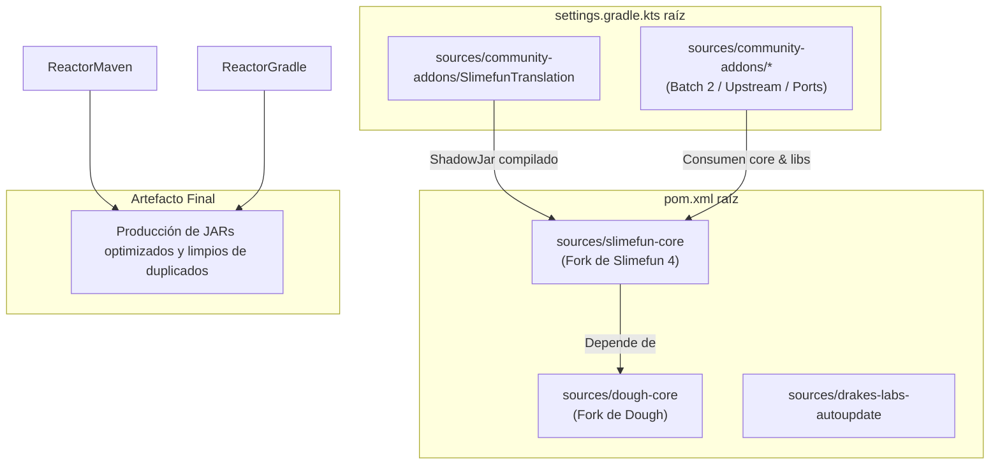

<p align="center">
  
</p>

<p align="center">
  <a href="https://github.com/DrakesCraft-Labs/drakes-slimefun-labs/actions/workflows/ci-monorepo-121.yml"></a>
  
  
  
  <a href="LICENSE"></a>
</p>

<p align="center">
  <strong>DrakesCraft Slimefun Foundry</strong> es el espacio de ingeniería del stack Slimefun de DrakesCraft: un monorepo curado que adapta, repara, asegura, compila y documenta Slimefun 4 junto con un extenso ecosistema de addons para servidores Paper modernos.
</p>

<p align="center">
  <a href="#qué-es-esto">Qué es esto</a> ·
  <a href="#por-qué-existe">Por qué existe</a> ·
  <a href="#arquitectura">Arquitectura</a> ·
  <a href="#mapa-del-repositorio">Mapa del repositorio</a> ·
  <a href="#compilación-y-control-de-calidad-qa">Compilación y QA</a>
</p>

---

## Qué es esto

Este repositorio no es un simple espejo desorganizado de plugins antiguos. Es una forja de compatibilidad controlada para la red de servidores **DrakesCraft** y el ecosistema general de Slimefun.

El objetivo es mantener Slimefun usable sobre una base de servidor moderna:

- **Minecraft/Paper:** Familia de Paper `1.21.1`.
- **Entorno de ejecución:** Java `21`.
- **Núcleo (Core):** Fork de Slimefun 4 mantenido por Drake, fork de Dough, parches de compatibilidad internos y librerías compartidas.
- **Addons:** Addons de la comunidad, adaptaciones (ports), módulos experimentales y módulos listos para producción agrupados en un único espacio de trabajo auditable.
- **Flujo de trabajo:** Reactores de Maven + Gradle, validación de integración continua (CI), guías de pruebas de humo, herramientas de lanzamiento en GitHub y mantenimiento de seguridad.

En términos sencillos: aquí es donde las piezas obsoletas, frágiles, abandonadas o dispersas de Slimefun se reconstruyen en un stack robusto que realmente puede sobrevivir en DrakesCraft.

## Por qué existe

Slimefun posee un ecosistema de addons inmenso, pero muchos plugins fueron creados para APIs antiguas de Bukkit/Paper, dependencias obsoletas, librerías abandonadas o asumiendo la compilación de un único addon. Esto genera un problema típico para un servidor de supervivencia real: un addon puede compilar, otro puede iniciar y otro puede corromper silenciosamente los datos, haciendo que el pack completo sea difícil de confiar.

DrakesCraft Slimefun Foundry existe para resolver esto de forma integral:

| Problema | Solución de Foundry |
|---|---|
| Addons orientados a APIs antiguas | Adaptar el código fuente a Paper 1.21.1 y Java 21. |
| Árboles de dependencias incompatibles | Centralizar la gestión de dependencias en el reactor raíz. |
| Librerías abandonadas y vulnerables | Reemplazarlas, parchearlas, sombrearlas (shade) o aislarlas con justificación documentada. |
| Forks con arreglos útiles | Auditar primero, integrar selectivamente y mantener el historial legible. |
| Compilaciones que solo funcionan en una máquina | CI, comandos reproducibles y documentación de la matriz de módulos. |
| Incertidumbre en producción | Guías de pruebas de humo y uso de DrakesCraft como entorno de supervivencia de referencia. |

## Dirección del proyecto

La base de desarrollo activa es **`main`**. Las ramas anteriores se mantienen únicamente como referencia histórica y base de comparación, no como el objetivo de desarrollo principal.

La dirección a largo plazo es:

1. Mantener todo el paquete compatible con la versión 1.21.x de forma segura y compilable.
2. Convertir más módulos del estado de "compila" a "verificado en ejecución".
3. Documentar el comportamiento de forma clara para que el equipo técnico, evaluadores de QA y futuros colaboradores puedan ayudar sin tener que comprender todo el reactor.
4. Mantener el trabajo experimental separado de la identidad de los plugins de producción, especialmente para módulos sensibles como Networks.
5. Preparar el proyecto para futuras versiones de Paper/Minecraft sin mezclar ramas incompatibles a ciegas.

## Arquitectura

<p align="center">
  
</p>

El monorepo está construido sobre unas capas muy específicas:

| Capa | Propósito |
|---|---|
| **Base (Foundation)** | Slimefun core, Dough, SefiLib, InfinityLib, parches de compatibilidad. |
| **Ports de producción** | Addons que se comportan como plugins normales una vez compilados. |
| **Módulos experimentales** | Trabajo que no debe colisionar con nombres de plugins de producción, comandos o datos. |
| **Automatización** | CI, colectores de lanzamiento, generación de matrices, scripts de portabilidad, asistentes de humo. |
| **Documentación** | Documentación operativa en español e inglés, acuerdos de QA, notas de migración y matriz de plugins. |

### Reactor Híbrido (Maven + Gradle)

Para gestionar un ecosistema tan diverso, Foundry emplea un modelo de compilación híbrido coordinado que combina proyectos Maven y proyectos Gradle en un flujo único y ordenado:




## Estado actual

El repositorio rastrea un paquete completo de Slimefun en lugar de un único plugin:

| Área | Estado |
|---|---|
| Reactor Maven | Paquete completo del reactor verificado localmente. |
| Addons Gradle | Integrados a través del flujo Gradle raíz cuando corresponde. |
| Alertas Dependabot | Limpias tras la última revisión de seguridad. |
| Networks | Código en [NetworksV6-drake](https://github.com/DrakesCraft-Labs/NetworksV6-drake); el monorepo solo consume el artefacto Maven. |
| Trabajo de fork Chagui | Auditado e integrado selectivamente; sin fusiones a ciegas. |
| QA en juego | Sigue siendo la frontera real: jugabilidad, menús, recetas, persistencia e interacción entre plugins. |

El estado detallado de cada módulo se encuentra en [`docs/es/PLUGIN_MATRIX.md`](docs/es/PLUGIN_MATRIX.md). Dicho archivo se genera automáticamente y actúa como tabla de auditoría; este README es la explicación de cara al público.

## Mapa del repositorio

```text
drakes-slimefun-labs/
├─ .github/workflows/                  Automatización de CI, releases y mantenimiento
├─ docs/                               Documentación central en ES/EN
├─ scripts/                            Generación de matrices, portabilidad y asistentes de pruebas
├─ sources/
│  ├─ slimefun-core/Slimefun4-src       Núcleo de Slimefun adaptado para Drake
│  ├─ dough-core/                       Fork de Dough adaptado para Drake
│  ├─ drakes-labs-autoupdate/           Librería compartida de actualización
│  ├─ batch-2-expansion/                Lote de expansión activo
│  ├─ community-addons/                 Integraciones de addons de la comunidad
│  ├─ repos-to-port/                    Addons adaptados desde upstream
│  └─ internal-metadata/patches/        Parches de compatibilidad controlados
├─ pom.xml                             Raíz del reactor Maven
└─ settings.gradle.kts                 Raíz del reactor Gradle
```

## Compilación y QA

Utiliza estos comandos desde la raíz del repositorio:

```powershell
# Reactor Maven completo, el mismo control utilizado para validación local.
mvn -f pom.xml -DskipTests package

# Regenerar la matriz de módulos generada.
python scripts/generate_plugin_matrix.py

# Compilar el artefacto SlimefunTranslation requerido por UltimateGenerators2 localmente.
cd sources/community-addons/SlimefunTranslation
.\gradlew.bat shadowJar --no-daemon
```

El proyecto separa intencionalmente el éxito de la compilación de la confianza en tiempo de ejecución. Un módulo puede compilar correctamente y aun así necesitar pruebas de humo en un servidor Paper antes de poder considerarse seguro para producción.

Comprobaciones recomendadas en juego:

- Inicio del servidor con el pack completo de plugins sin errores de consola.
- Apertura de la guía Slimefun y navegación por sus categorías.
- Comportamiento de máquinas, generadores, transporte/redes y persistencia tras reiniciar el servidor.
- Interacciones con economía, protección de terrenos, WorldEdit, Towny, mcMMO y otros plugins.
- Revisión de advertencias (warnings) en logs que no fallen en la compilación pero importen en un servidor activo.

## Documentación

| Necesidad | Empieza aquí |
|---|---|
| Índice de documentación central | [`docs/README.md`](docs/README.md) |
| Página de inicio en español | [`docs/es/home.md`](docs/es/home.md) |
| Página de inicio en inglés | [`docs/en/home.md`](docs/en/home.md) |
| Matriz de plugins generada | [`docs/es/PLUGIN_MATRIX.md`](docs/es/PLUGIN_MATRIX.md) |
| Guía de pruebas de humo | [`docs/es/smoke-test-guide.md`](docs/es/smoke-test-guide.md) |
| Mantenimiento de GitHub | [`docs/github-maintenance.md`](docs/github-maintenance.md) |
| Auditoría del fork de Chagui | [`docs/chagui-fork-audit.md`](docs/chagui-fork-audit.md) |
| Notas de la wiki de ejecución | [`docs/wiki/README.md`](docs/wiki/README.md) |

## Propuesta de nomenclatura

El slug actual del repositorio sigue siendo `drakes-slimefun-labs` para mantener compatibilidad con enlaces y remotos existentes.

Nombre público recomendado:

```text
DrakesCraft Slimefun Foundry
```

Slug de repositorio futuro recomendado:

```text
slimefun-foundry
```

Este nombre es más corto, memorable y refleja mejor la naturaleza del proyecto: no solo un "laboratorio", sino un espacio donde el stack se forja, se prueba, se asegura y se publica.

## Licencia

Este repositorio se distribuye bajo la licencia **GPLv3**. Ver [`LICENSE`](LICENSE).
