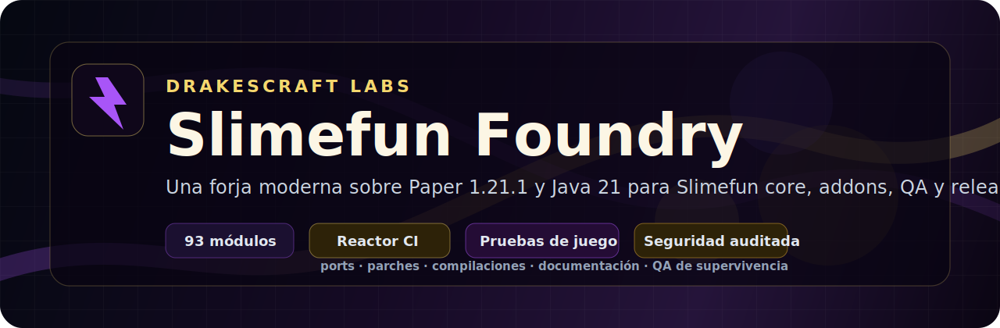
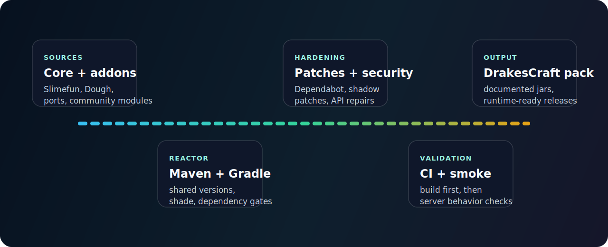

<p align="center">
  
</p>

<p align="center">
  <a href="https://github.com/DrakesCraft-Labs/drakes-slimefun-labs/actions/workflows/ci-monorepo-121.yml"></a>
  
  
  
  <a href="LICENSE"></a>
</p>

<p align="center">
  <strong>DrakesCraft Slimefun Foundry</strong> is the engineering home for the DrakesCraft Slimefun stack: a curated monorepo that ports, repairs, secures, builds, and documents Slimefun 4 plus a large addon ecosystem for modern Paper servers.
</p>

<p align="center">
  <a href="#what-this-is">What this is</a> ·
  <a href="#why-it-exists">Why it exists</a> ·
  <a href="#architecture">Architecture</a> ·
  <a href="#repository-map">Repository map</a> ·
  <a href="#build-and-qa">Build and QA</a>
</p>

---

## What This Is

This repository is not a loose mirror of old plugins. It is a controlled compatibility foundry for the **DrakesCraft** server network and the wider Slimefun ecosystem.

The goal is to keep Slimefun usable on a modern server baseline:

- **Minecraft/Paper:** Paper `1.21.1` family.
- **Runtime:** Java `21`.
- **Core:** Drake-maintained Slimefun 4 fork, Dough fork, internal compatibility patches, and shared libraries.
- **Addons:** community addons, ports, experimental modules, and production-ready modules grouped in one auditable workspace.
- **Workflow:** Maven + Gradle reactors, CI gates, smoke-test guides, GitHub release tooling, and security maintenance.

In plain terms: this is where old, fragile, abandoned, or scattered Slimefun pieces get rebuilt into a stack that can actually survive on DrakesCraft.

## Why It Exists

Slimefun has a huge addon ecosystem, but many plugins were built for older Bukkit/Paper APIs, stale dependencies, abandoned libraries, or single-addon build assumptions. That creates a familiar problem for a real survival server: one addon can compile, another can boot, another can silently corrupt state, and the full pack becomes hard to trust.

DrakesCraft Slimefun Foundry exists to solve that as a system:

| Problem | Foundry answer |
|---|---|
| Addons targeting old APIs | Port source code to Paper 1.21.1 and Java 21. |
| Incompatible dependency trees | Centralize dependency management in the root reactor. |
| Abandoned vulnerable libraries | Replace, patch, shade, or isolate them with documented rationale. |
| Forks with useful fixes | Audit first, integrate selectively, keep history readable. |
| Builds that only work on one machine | CI, reproducible commands, and module matrix docs. |
| Runtime uncertainty | Smoke-test guides and DrakesCraft as the reference survival environment. |

## Project Direction

The active baseline is **`main`**. The older **`1.21-latin`** line is kept as historical reference and comparison base, not as the main development target.

The long-term direction is:

1. Keep the full 1.21.x pack compiling and secure.
2. Convert more modules from "compiles" to "runtime-smoked".
3. Document behavior clearly enough that staff, QA testers, and future contributors can help without needing to understand the entire reactor.
4. Keep experimental work separated from production plugin identity, especially for sensitive modules like Networks.
5. Prepare the project for future Paper/Minecraft lines without mixing incompatible branches blindly.

## Architecture

<p align="center">
  
</p>

The monorepo is built around a few deliberate layers:

| Layer | Purpose |
|---|---|
| **Foundation** | Slimefun core, Dough, SefiLib, InfinityLib, compatibility patches. |
| **Production ports** | Addons that are intended to behave like normal server plugins once built. |
| **Experimental modules** | Work that must not collide with production plugin names, commands, or data. |
| **Automation** | CI, release collectors, matrix generation, porting scripts, smoke helpers. |
| **Docs** | Spanish and English operational documentation, QA agreements, migration notes, and plugin matrix. |

## Current Status

The repository currently tracks a full Slimefun pack rather than a single plugin:

| Area | Status |
|---|---|
| Maven reactor | Full reactor package verified locally. |
| Gradle addons | Integrated through the root Gradle workflow where applicable. |
| Dependabot alerts | Clean after the latest security pass. |
| Networks | Production and experimental identities separated. |
| Chagui fork work | Audited and integrated selectively; no blind merge. |
| Runtime QA | Still the real next frontier: gameplay, menus, recipes, persistence, and plugin interactions. |

Detailed module status lives in [`docs/es/PLUGIN_MATRIX.md`](docs/es/PLUGIN_MATRIX.md). That file is generated and should stay as the audit table; this README is the public-facing explanation.

## Repository Map

```text
drakes-slimefun-labs/
├─ .github/workflows/                  CI, release, maintenance automation
├─ docs/                               central documentation in ES/EN
├─ scripts/                            matrix generation, porting, smoke helpers
├─ sources/
│  ├─ slimefun-core/Slimefun4-src       Drake Slimefun core
│  ├─ dough-core/                       Drake Dough fork
│  ├─ drakes-labs-autoupdate/           shared updater library
│  ├─ batch-2-expansion/                active expansion batch
│  ├─ community-addons/                 community addon integrations
│  ├─ repos-to-port/                    ported upstream addons
│  └─ internal-metadata/patches/        controlled compatibility patches
├─ pom.xml                             Maven reactor root
└─ settings.gradle.kts                 Gradle reactor root
```

## Build And QA

Use these commands from the repository root.

```powershell
# Full Maven reactor, same practical gate used for broad local verification.
mvn -f pom.xml -DskipTests package

# Regenerate the generated module matrix.
python scripts/generate_plugin_matrix.py

# Build the SlimefunTranslation artifact required by UltimateGenerators2 in local runs.
cd sources/community-addons/SlimefunTranslation
.\gradlew.bat shadowJar --no-daemon
```

The project intentionally separates build success from runtime confidence. A module can compile and still need smoke testing in a Paper server before it should be trusted in production.

Recommended runtime checks:

- Server boot with the full plugin pack.
- Slimefun guide opening and category navigation.
- Machines, generators, cargo/network behavior, and persistence after restart.
- Economy, protection, WorldEdit, Towny, mcMMO, and other integration-sensitive paths.
- Logs for warnings that do not fail compilation but matter in a live server.

## Documentation

| Need | Start here |
|---|---|
| Central documentation index | [`docs/README.md`](docs/README.md) |
| Spanish landing docs | [`docs/es/home.md`](docs/es/home.md) |
| English landing docs | [`docs/en/home.md`](docs/en/home.md) |
| Generated plugin matrix | [`docs/es/PLUGIN_MATRIX.md`](docs/es/PLUGIN_MATRIX.md) |
| Smoke testing guide | [`docs/es/smoke-test-guide.md`](docs/es/smoke-test-guide.md) |
| GitHub maintenance | [`docs/github-maintenance.md`](docs/github-maintenance.md) |
| Chagui fork audit | [`docs/chagui-fork-audit.md`](docs/chagui-fork-audit.md) |
| Runtime wiki notes | [`docs/wiki/README.md`](docs/wiki/README.md) |

## Naming Proposal

The current repository slug is still `drakes-slimefun-labs` for compatibility with existing links and remotes.

Recommended public name:

```text
DrakesCraft Slimefun Foundry
```

Recommended future repository slug:

```text
slimefun-foundry
```

That name is shorter, more memorable, and better reflects the project: not just "labs", but a place where the stack is forged, tested, hardened, and released.

## License

This repository is licensed under **GPLv3**. See [`LICENSE`](LICENSE).
