<h1 align="center">Coronalis</h1>

<p align="center">
  Addon Slimefun de <strong>radioastronomía e interferometría</strong> — nombre propio del ecosistema JackStar6677.<br/>
  <em>No</em> es AstroControlSim. <em>No</em> usa marcas de terceros.
</p>

<p align="center">
  <a href="https://github.com/JackStar6677-1/Coronalis"></a>
  <a href="https://github.com/JackStar6677-1/AstroControlSim"></a>
  
  
</p>

---

## Por qué «Coronalis»

Misma familia de nombres que **AuroralisStar**, **VoidWhisper**, **StellarDaybook**: un compuesto inventado, corto y buscable en GitHub.

- **Corona** → emisión, radio, análisis de fase  
- **-alis** → línea Auroralis / identidad visual compartida  

Sin colisión con juegos ni marcas registradas tipo *Voices of the Void*.

---

## Ecosistema (repos distintos)

| Repo | Rol |
|------|-----|
| **[Coronalis](https://github.com/JackStar6677-1/Coronalis)** | Este addon Minecraft |
| **[AstroControlSim](https://github.com/JackStar6677-1/AstroControlSim)** | Simulador C++/Python (solo escritorio) |
| [VoidWhisper](https://github.com/JackStar6677-1/VoidWhisper) · [AuroralisStar](https://github.com/JackStar6677-1/AuroralisStar) · [StellarDaybook](https://github.com/JackStar6677-1/StellarDaybook) | Otros proyectos Jack |

---

## Jugabilidad

- Array de radiotelescopios + consola de correlación (PID, telemetría, fallas).  
- Objetivos celestes (Crab, Sgr A*, M87*, etc.).  
- **Eco de fase correlacionada** — ítem de catálogo, clic derecho → XP.  
- Investigaciones Slimefun en 4 niveles.  
- Descubrimientos persistentes (más XP la primera vez).

---

## Build

```powershell
mvn -pl sources/community-addons/Coronalis -am -DskipTests package
```

JAR: `target/Coronalis-vUNOFFICIAL.jar`

[CREDITS.md](CREDITS.md) · [docs/GITHUB_SETUP.md](docs/GITHUB_SETUP.md)
