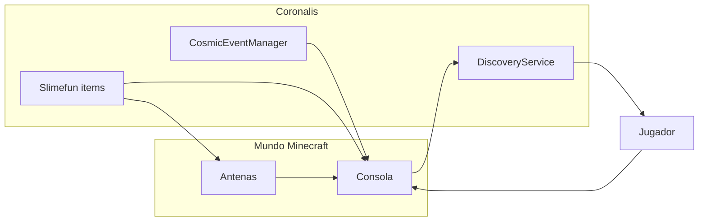

<h1 align="center">Coronalis</h1>

<p align="center">
  <strong>Addon Slimefun de radioastronomía, interferometría y descubrimientos con XP</strong><br/>
  Proyecto original de <a href="https://github.com/JackStar6677-1">JackStar6677</a> para Paper 1.21 — sin vínculo con simuladores de escritorio ni marcas de terceros.
</p>

<p align="center">
  <a href="https://github.com/JackStar6677-1/Coronalis"></a>
  
  
  
</p>

---

## Qué es Coronalis

**Coronalis** convierte tu mundo de Minecraft en un observatorio de radio interferométrico: montas antenas, enlazas una consola de correlación, apuntas a objetivos del cielo profundo y ganas **XP de Minecraft** cada vez que catalogas una señal por primera vez.

El nombre sigue la línea de proyectos Jack (**AuroralisStar**, **VoidWhisper**, **StellarDaybook**): compuesto inventado, memorable y sin colisionar con IPs ajenas.

| Concepto | En el juego |
|----------|-------------|
| **Corona / fase** | Correlación de señales entre antenas |
| **Array** | Red de radiotelescopios alrededor de la consola |
| **Eco de fase** | Ítem de catálogo con datos de un descubrimiento |
| **Cielo profundo** | Objetivos de dificultad creciente (nebulosas → M87*) |

---

## Características

### Infraestructura de observatorio

- **Plato de antena**, **receptor 1 mm**, **controlador PID** y **celda de datos** — componentes de crafteo con lore *Coronalis Array Labs*.
- **Escucha del Vacío — Antena**: bloque colocable; debe estar a ≤15 bloques de la consola.
- **Consola de control del observatorio**: GUI de operaciones (objetivos, alineación, correlación).

### Sistema de descubrimientos (XP)

- Progreso guardado en **PDC** del jugador (persistente entre sesiones).
- **Primera vez** que correlacionas o analizas un objetivo → más XP; repeticiones → menos.
- **Eco de fase correlacionada**: clic derecho para analizar y recibir XP (configurable).
- Bonus al desbloquear investigaciones Slimefun del addon.

### Objetivos celestes

| Objetivo | Tier | Antenas mín. |
|----------|------|--------------|
| Nebulosa Cabeza de Caballo | Fácil | 10 |
| Nebulosa del Cangrejo | Intermedio | 11 |
| Galaxia de Andrómeda | Intermedio | 12 |
| Púlsar PSR B1919+21 | Difícil | 13 |
| Sagitario A* | Difícil | 14 |
| Exoplaneta Kepler-186f | Legendario | 15 |
| Agujero negro M87* | Legendario | 16 |

Cada tier aplica un **multiplicador de XP** sobre los valores de `config.yml`.

### Investigaciones Slimefun

1. **Ingeniería de radio** — antena y receptor  
2. **Control PID del vacío** — PID y telescopio  
3. **Interferometría VLBI** — celda de datos  
4. **Operaciones de cielo profundo** — consola y eco de fase  

### Eventos cósmicos

El **CosmicEventManager** puede disparar eventos aleatorios (ventanas de 60–180 s, probabilidad configurable) que alteran la sesión de observación.

### Código en evolución

El repo incluye también capas de red y acceso (`CoronalisNetwork`, `NetworkRegistry`, `AccessManager`, `SoundManager`, `TelescopeState`) para ampliar multijugador y telemetría en futuras versiones.

---

## Arquitectura (resumen)



---

## Requisitos

| Dependencia | Versión |
|-------------|---------|
| **Paper** | 1.21.1 |
| **Slimefun 6** (fork Drake / DrakesCraft-Labs) | 11.x |
| **Java** | 21 |

En servidores Drake, el JAR se publica como **`Coronalis-drake`** vía autoupdate del monorepo.

---

## Instalación

1. Compila o descarga `Coronalis.jar` (ver [Build](#build)).
2. Coloca el JAR en `plugins/` junto a **Slimefun** y **Dough** (Drake).
3. Reinicia el servidor; se genera `plugins/Coronalis/config.yml`.
4. Investiga en Slimefun, craftea la consola y las antenas, y empieza a apuntar.

---

## Configuración

Fragmento de `config.yml` (XP y eventos):

```yaml
discovery-xp:
  first_target_lock: 6
  tracking_lock: 10
  first_correlation: 25
  record_analysis: 200
  record_repeat: 40

cosmic-events:
  chance-denominator: 3
  min-duration-seconds: 60
  max-duration-seconds: 180

research-unlock-bonus-xp: 10
```

Ajusta valores sin recompilar; recarga con el reinicio del plugin o recarga de config si tu build lo expone.

---

## Build

### Repo público (este repositorio)

```powershell
cd Coronalis
mvn -DskipTests package
```

Salida: `target/Coronalis.jar`

> Necesitas acceso al repositorio Maven de **DrakesCraft-Labs** (`slimefun-core`, `dough-core`, `drakes-labs-autoupdate`). Configura `GITHUB_TOKEN` o credenciales en `settings.xml` si Maven falla al resolver dependencias.

### Monorepo DrakesCraft-Labs

```powershell
mvn -pl sources/community-addons/Coronalis -am -DskipTests package
```

Salida: `Coronalis-vUNOFFICIAL.jar` en `target/` del módulo.

---

## Estructura del proyecto

```
Coronalis/
├── assets/hero.svg              # Banner README
├── assets/banner-github-social.svg
├── src/main/java/.../coronalis/
│   ├── Coronalis.java           # Plugin principal
│   ├── discovery/               # XP y PDC
│   ├── implementation/          # Items, consola, telescopio
│   ├── managers/                # Eventos cósmicos, red, sonido
│   └── ...
├── src/main/resources/
│   ├── plugin.yml
│   └── config.yml
├── pom.xml
├── README.md
└── CREDITS.md
```

---

## Créditos y soporte

- Autor: **[JackStar6677](https://github.com/JackStar6677-1)**  
- Issues: [github.com/JackStar6677-1/Coronalis/issues](https://github.com/JackStar6677-1/Coronalis/issues)  
- Detalle de marca: [CREDITS.md](CREDITS.md)  
- Publicar en GitHub: [docs/GITHUB_SETUP.md](docs/GITHUB_SETUP.md)

---

<p align="center">
  <em>Coronalis Array Labs — escucha el vacío, cataloga la fase, gana XP.</em>
</p>
