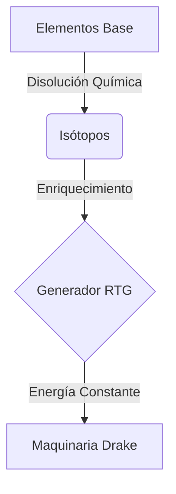

<!-- drakes-labs:branch-26x-notice -->

> **Rama `26.X-ToTheStars` — Minecraft / Paper 26.x:** porte hacia la API **Paper 26.x** (p. ej. artefactos `26.1.x.build.*-alpha` en repo.papermc.io). Por defecto el `pom.xml` raíz sigue con **`paper.version=1.21.1-R0.1-SNAPSHOT`**; para compilar contra la API 26.x: `mvn -B -DskipTests -Ppaper-26-preview compile -fae`. La línea estable **Paper 1.21.x**, CI y smoke de referencia están en la rama **`1.21-latin`**. Guía: `docs/paper-26-base.md`.

# 🧪 SlimeChem

## 🌌 El Corazón de la Alquimia Nuclear
**SlimeChem** es un addon avanzado para el ecosistema **Drake Slimefun** enfocado en la química nuclear, la transmutación de elementos y la generación de energía mediante isótopos inestables.

> [!IMPORTANT]
> Esta versión ha sido reconstruida para **Minecraft 1.21.1** y **Java 21**, eliminando dependencias obsoletas y optimizando el rendimiento molecular.

---

## ✨ Características Premium

| Característica | Descripción |
| :--- | :--- |
| **☢️ Fisión de Partículas** | Sistemas complejos de fisión para extraer isótopos raros. |
| **⚗️ Reactor Térmico** | Generador de radioisótopos (RTG) con salida de energía ultra-estable. |
| **⚛️ Tabla Periódica** | Categoría flexible integrada con navegación intuitiva por elementos. |
| **💎 Transmutación** | Convierte metales base en materiales de grado galáctico. |

---

## 🛠️ Especificaciones Técnicas

- **Compatibilidad**: Slimefun Drake Edition.
- **Motor**: Java 21.
- **Versión**: 1.21.1-Drake-Stabilized.

---

## 🚀 Instalación y Uso
Este addon viene pre-instalado en el ecosistema **DrakesVanillaSlimefun+**.
1. Abre tu Guía de Slimefun.
2. Busca la categoría **Química Nuclear (SlimeChem)**.
3. Empieza tu viaje hacia el dominio de los elementos.

---

[⬅️ Volver a la Suite Principal](../../README.md)

<!-- DRAKES-STATUS:BEGIN -->
> Estado de sincronizacion: **2026-04-24**.
> Baseline tecnico vigente: **Paper 1.21.1 + Java 21**.
> CI principal en `1.21-latin`: **Gates 1-5 en verde**.
> Nota: el monorepo completo sigue en migracion incremental por lotes.
<!-- DRAKES-STATUS:END -->
